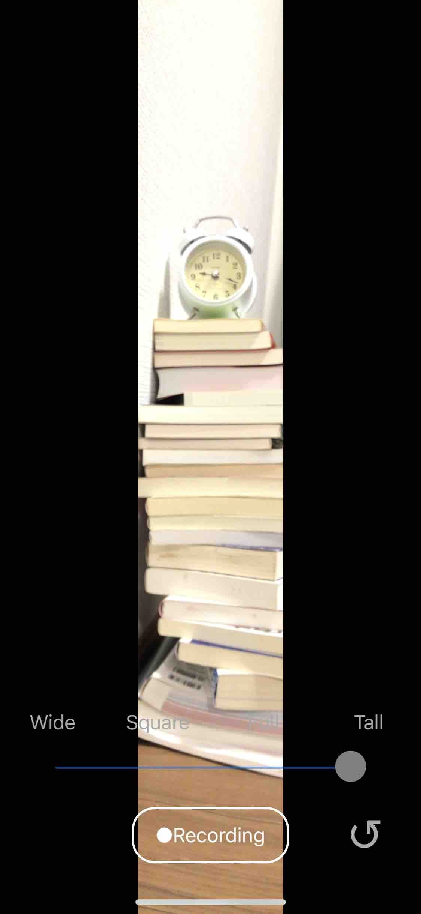

# FlexCamera

Source code of [Flex Camera](https://itunes.apple.com/us/app/flex-camera/id1455345286?mt=8) app for iOS.

<a href="https://itunes.apple.com/us/app/flex-camera/id1455345286?mt=8" style="display:inline-block;overflow:hidden;background:url(https://linkmaker.itunes.apple.com/en-us/badge-lrg.svg?releaseDate=2019-03-10&kind=iossoftware&bubble=ios_apps) no-repeat;width:135px;height:40px;"></a>

## Screenshots

| | | | |
|-|-|-|-|
| | | |

## Dependencies

This project depends on following CocoaPods library.

+ [FlexibleAVCapture](https://cocoapods.org/pods/FlexibleAVCapture) 2.2.3

Running following command will install dependency.

```
$ pod install
```

## Author

hahnah

+ Web Site: [https://superhahnah.com](https://superhahnah.com)
+ Twitter: [@superhahnah](https://twitter.com/superhahnah)

## License

Apache License 2.0 &copy; [hahnah](https://superhahnah.com)
